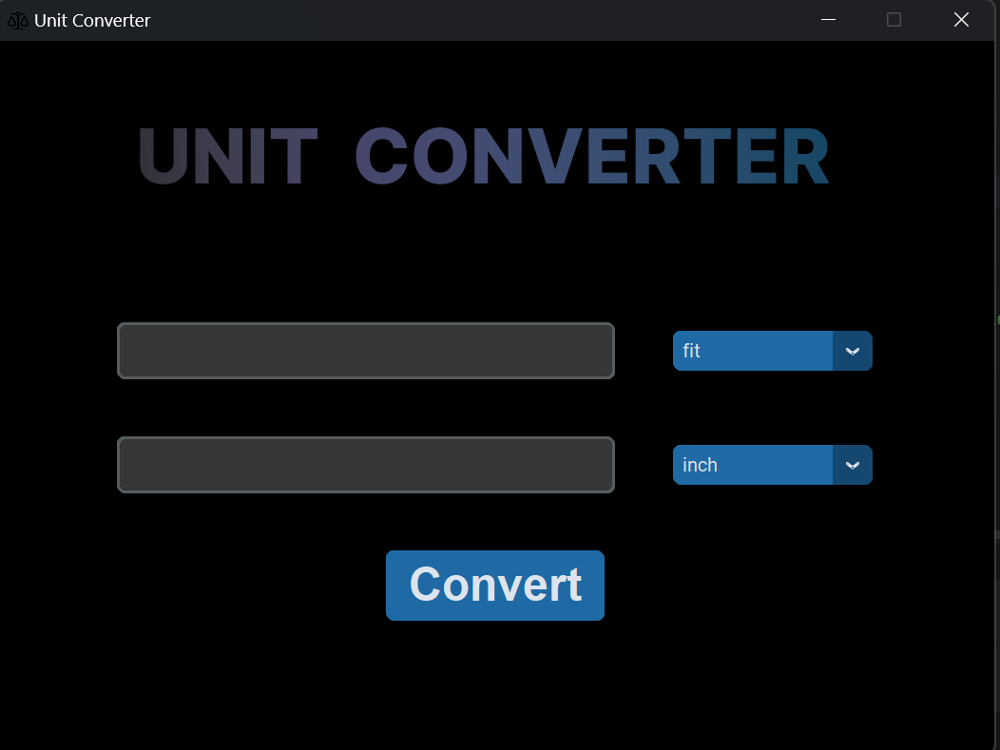

# Hi, I'm White Angel! 👋


## 🚀 About Me
I'm a developer and a student...


# Unit Converter

This is simple Unit Converter Application build in python programming language.


## Installation

**Install Unit Converter from Github.**

Install python from https://www.python.org/downloads/

Install Git from https://www.git-scm.com/downloads

you can skip this step if you have already installed the python and git.


- **clone Project to your local computer.**
```bash
  git clone https://github.com/Karelaking/Unit_Coverter.git
```

- **Go to the project folder**
```bash
cd Unit Converter
```

- **install requirements for the unit converter**
```bash
pip install -r requirements.txt
```

- **Run Unit_Converter.py**
```bash
python3 Unit_Converter.py
```
## License

[MIT](License)


## Optimizations

I will try to make it batter and more batter according to youe suggestions.

## Screenshots




## Acknowledgements

 - [Git](https://www.git-scm.com/downloads)
 - [python3](https://www.python.org/downloads/)
 - [readme](https://readme.so/)
 - [Firgma](https://www.figma.com/)
 - [opensource](https://opensource.org/license/mit/)
 - [icon-icons](https://icon-icons.com/)
## Support

For support, email karelaking277@gmail.com.

